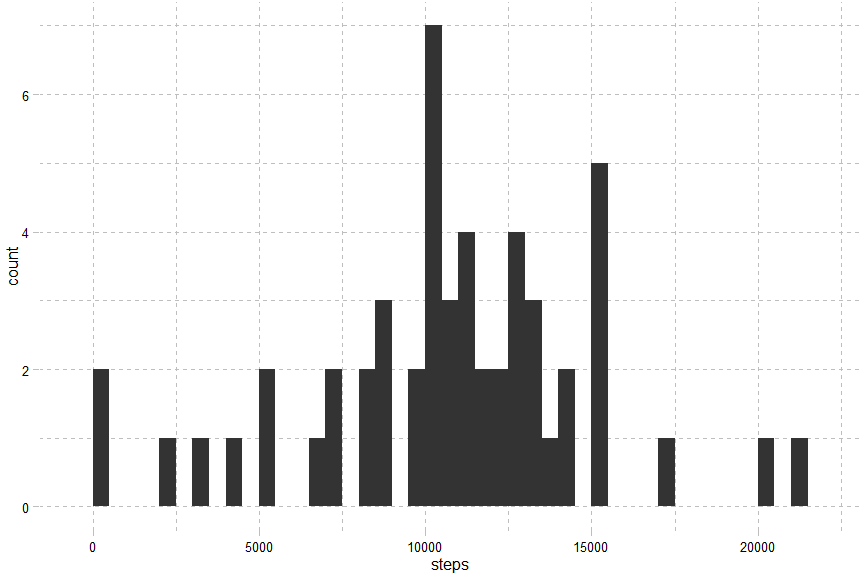
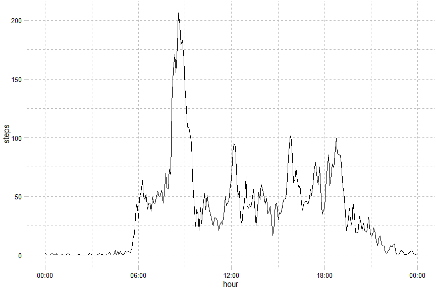
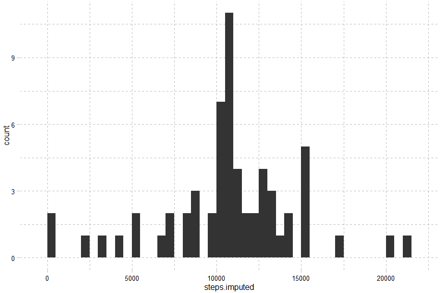
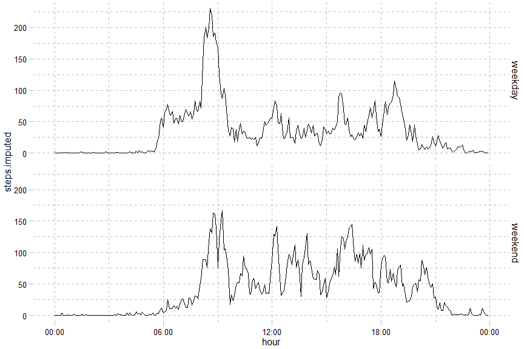

# Reproducible Research: Peer Assessment 1


## Loading and preprocessing the data

*Show any code that is needed to:*

1. *Load the data (i.e. `read.csv()`).*
2. *Process/transform the data (if necessary) into a format suitable for your analysis.*


```r
library(xts)
library(lubridate)
library(dplyr)
library(tidyr)
library(ggplot2)
library(scales)
# library(devtools)
# install_github("jrnold/ggthemes")
library(ggthemes)
library(pander)

options(scipen = 1, digits = 2)
```

The data is provided as a CSV file `activity.csv`. First, it is loaded as a `tbl_df` object, suitable for further processing with `dplyr`. Next, dates and intervals are transformed into a POSIX compliant form:

a) `hour` is a POSIX time variable, coupled with a dummy date (1900-01-01),
b) `time` is a POSIX date-time variable, indicating 5-minute intervals (eg. 2012-10-01 00:05).


```r
activity <- "data/activity.csv" %>%
    read.csv(stringsAsFactors = FALSE) %>%
    tbl_df %>%
    mutate(
        hour.string = sprintf("%04d", interval),
        hour = ymd_hm(paste("1900-01-01", hour.string)),
        time = ymd_hm(paste(date, hour.string))
    )
```

Radom 10 rows are presented below.


```r
activity %>% sample_n(10) %>% arrange(time) %>% pander(split.table = Inf)
```


-----------------------------------------------------------------------------------
 steps     date     interval   hour.string         hour                time        
------- ---------- ---------- ------------- ------------------- -------------------
  NA    2012-10-01    430         0430      1900-01-01 04:30:00 2012-10-01 04:30:00

  126   2012-10-03    750         0750      1900-01-01 07:50:00 2012-10-03 07:50:00

  100   2012-10-03    1350        1350      1900-01-01 13:50:00 2012-10-03 13:50:00

  NA    2012-10-08    2125        2125      1900-01-01 21:25:00 2012-10-08 21:25:00

   0    2012-10-16    1115        1115      1900-01-01 11:15:00 2012-10-16 11:15:00

   0    2012-10-23    2050        2050      1900-01-01 20:50:00 2012-10-23 20:50:00

   0    2012-10-24    215         0215      1900-01-01 02:15:00 2012-10-24 02:15:00

   0    2012-10-27    430         0430      1900-01-01 04:30:00 2012-10-27 04:30:00

  591   2012-10-29    2050        2050      1900-01-01 20:50:00 2012-10-29 20:50:00

   0    2012-11-17    925         0925      1900-01-01 09:25:00 2012-11-17 09:25:00
-----------------------------------------------------------------------------------

## What is mean total number of steps taken per day?

*For this part of the assignment, you can ignore the missing values in the dataset.*

1. *Make a histogram of the total number of steps taken each day.*
2. *Calculate and report the mean and median total number of steps taken per day.*

In this step, data is aggregated in daily intervals.


```r
activity.daily <- activity %>%
    group_by(date) %>%
    summarise(steps = sum(steps))

activity.daily %>% sample_n(10) %>% arrange(date) %>% pander(split.table = Inf)
```


------------------
   date     steps 
---------- -------
2012-10-16  15084 

2012-10-17  13452 

2012-10-30  9819  

2012-11-01   NA   

2012-11-04   NA   

2012-11-05  10439 

2012-11-20  4472  

2012-11-24  14478 

2012-11-25  11834 

2012-11-27  13646 
------------------

Histogram of daily aggregated number of steps.


```r
activity.daily %>%
    ggplot +
    geom_histogram(aes(steps), binwidth = 500) +
    theme_pander() +
    scale_colour_pander()
```

 

Summary of `steps` variable.


```r
activity.stats <- activity.daily$steps %>%
    summary(digits = 5) %>%
    data_frame(stat = names(.), steps = .)

activity.stats %>% pander
```


---------------
 stat    steps 
------- -------
 Min.     41   

1st Qu.  8841  

Median   10765 

 Mean    10766 

3rd Qu.  13294 

 Max.    21194 

 NA's      8   
---------------

```r
# activity.daily$steps %>% mean(na.rm = TRUE)
# activity.daily$steps %>% median(na.rm = TRUE)
```

1. The **mean** is 10766.19.
2. The **median** is 10765.

## What is the average daily activity pattern?

1. *Make a time series plot (i.e. `type = "l"`) of the 5-minute interval (x-axis) and the average number of steps taken, averaged across all days (y-axis).*
2. *Which 5-minute interval, on average across all the days in the dataset, contains the maximum number of steps?*

In this step, data is averaged across all days.


```r
activity.hourly <- activity %>%
    group_by(interval, hour) %>%
    summarise(steps = mean(steps, na.rm = TRUE)) %>%
    ungroup

activity.hourly %>% sample_n(10) %>% arrange(hour) %>% pander(split.table = Inf)
```


--------------------------------------
 interval         hour          steps 
---------- ------------------- -------
   535     1900-01-01 05:35:00  6.057 

   705     1900-01-01 07:05:00  44.38 

   930     1900-01-01 09:30:00  66.21 

   940     1900-01-01 09:40:00  24.79 

   945     1900-01-01 09:45:00  38.75 

   1035    1900-01-01 10:35:00  37.42 

   1235    1900-01-01 12:35:00  32.42 

   1510    1900-01-01 15:10:00  35.49 

   1915    1900-01-01 19:15:00  53.36 

   2155    1900-01-01 21:55:00  2.623 
--------------------------------------

Time series plot.


```r
activity.hourly %>%
    ggplot +
    geom_line(aes(hour, steps)) +
    scale_x_datetime(labels = date_format("%H:%M")) +
    theme_pander() +
    scale_colour_pander()
```

 

```r
activity.hourly %>%
    filter(steps == max(steps))
```

```
## Source: local data frame [1 x 3]
## 
##   interval                hour steps
## 1      835 1900-01-01 08:35:00   206
```

The maximum number of steps (206.17) happens at the interval of 08:35.

## Imputing missing values

*Note that there are a number of days/intervals where there are missing values (coded as `NA`). The presence of missing days may introduce bias into some calculations or summaries of the data.*

1. *Calculate and report the total number of missing values in the dataset (i.e. the total number of rows with `NA`s).*
2. *Devise a strategy for filling in all of the missing values in the dataset. The strategy does not need to be sophisticated. For example, you could use the mean/median for that day, or the mean for that 5-minute interval, etc.*
3. *Create a new dataset that is equal to the original dataset but with the missing data filled in.*
4. *Make a histogram of the total number of steps taken each day and Calculate and report the mean and median total number of steps taken per day. Do these values differ from the estimates from the first part of the assignment? What is the impact of imputing missing data on the estimates of the total daily number of steps?*

Count of complete cases (*i.e.* with no `NA`s) in the data set.


```r
activity %>% complete.cases %>% table
```

```
## activity %>% complete.cases
## FALSE  TRUE 
##  2304 15264
```

The total number of rows with missing values is 2304.

We are going to impute missing values for any interval by substituting it with the average value for that interval, averaged across all days.


```r
activity <- activity %>%
    left_join(activity.hourly %>% select(interval, steps.imputed = steps), by = "interval") %>%
    mutate(steps.imputed = ifelse(is.na(steps), round(steps.imputed), steps))
```

Again, data is aggregated in daily intervals.


```r
activity.daily <- activity %>%
    group_by(date) %>%
    summarise(steps = sum(steps), steps.imputed = sum(steps.imputed))

activity.daily %>% sample_n(10) %>% arrange(date) %>% pander(split.table = Inf)
```


----------------------------------
   date     steps   steps.imputed 
---------- ------- ---------------
2012-10-03  11352       11352     

2012-10-04  12116       12116     

2012-10-07  11015       11015     

2012-10-28  11458       11458     

2012-11-06  8334        8334      

2012-11-12  10765       10765     

2012-11-14   NA         10762     

2012-11-22  20427       20427     

2012-11-24  14478       14478     

2012-11-29  7047        7047      
----------------------------------

Histogram of daily aggregated number of steps.


```r
activity.daily %>%
    ggplot +
    geom_histogram(aes(steps.imputed), binwidth = 500) +
    theme_pander() +
    scale_colour_pander()
```

 

Summary of `steps.imputed` variable, compared to `steps`.


```r
activity.stats <- activity.stats %>%
    left_join(
        activity.daily$steps.imputed %>%
            summary(digits = 5) %>%
            data_frame(stat = names(.), steps.imputed = .),
        by = "stat"
    )

activity.stats %>% pander
```


-------------------------------
 stat    steps   steps.imputed 
------- ------- ---------------
 Min.     41          41       

1st Qu.  8841        9819      

Median   10765       10762     

 Mean    10766       10766     

3rd Qu.  13294       12811     

 Max.    21194       21194     

 NA's      8          NA       
-------------------------------

```r
# activity.daily$steps.imputed %>% mean(na.rm = TRUE)
# activity.daily$steps.imputed %>% median(na.rm = TRUE)
```

1. The **mean** is 10765.64, which is almost the same as the mean of the original data (10766.19).
2. The **median** is 10762, which is slightly less than the median of the original data (10765).

## Are there differences in activity patterns between weekdays and weekends?

*For this part the `weekdays()` function may be of some help here. Use the dataset with the filled-in missing values for this part.*

1. *Create a new factor variable in the dataset with two levels -- "weekday" and "weekend" indicating whether a given date is a weekday or weekend day.*
2. *Make a panel plot containing a time series plot (i.e. `type = "l"`) of the 5-minute interval (x-axis) and the average number of steps taken, averaged across all weekday days or weekend days (y-axis).*

Adding a factor variable `day.type`.


```r
activity <- activity %>%
    mutate(
        day.type = factor(
            wday(time) %in% c(1, 7),
            labels = c("weekday", "weekend")
        )
    )
```

In this step, data is averaged across all days, but in two groups: weekdays and weekends.


```r
activity.hourly.weekend <- activity %>%
    group_by(day.type, hour) %>%
    summarise(steps.imputed = mean(steps.imputed, na.rm = TRUE)) %>%
    ungroup

activity.hourly.weekend %>% sample_n(10) %>% arrange(day.type, hour) %>% pander(split.table = Inf)
```


----------------------------------------------
 day.type         hour          steps.imputed 
---------- ------------------- ---------------
 weekday   1900-01-01 12:35:00      30.69     

 weekday   1900-01-01 14:30:00      31.51     

 weekday   1900-01-01 18:40:00      91.67     

 weekday   1900-01-01 20:50:00      25.93     

 weekend   1900-01-01 03:10:00        0       

 weekend   1900-01-01 07:45:00      30.69     

 weekend   1900-01-01 09:10:00      151.8     

 weekend   1900-01-01 21:35:00      15.69     

 weekend   1900-01-01 21:40:00      13.06     

 weekend   1900-01-01 22:40:00      1.062     
----------------------------------------------

Time series plot.


```r
activity.hourly.weekend %>%
    ggplot +
    geom_line(aes(hour, steps.imputed)) +
    facet_grid(day.type ~ .) +
    scale_x_datetime(labels = date_format("%H:%M")) +
    theme_pander() +
    scale_colour_pander()
```

 

## Session Info


```r
sessionInfo()
```

```
## R version 3.1.2 Patched (2014-11-14 r66984)
## Platform: x86_64-w64-mingw32/x64 (64-bit)
## 
## locale:
## [1] LC_COLLATE=Polish_Poland.1250  LC_CTYPE=Polish_Poland.1250   
## [3] LC_MONETARY=Polish_Poland.1250 LC_NUMERIC=C                  
## [5] LC_TIME=Polish_Poland.1250    
## 
## attached base packages:
## [1] stats     graphics  grDevices utils     datasets  methods   base     
## 
## other attached packages:
## [1] pander_0.5.2     ggthemes_1.9.0   scales_0.2.4     ggplot2_1.0.0   
## [5] tidyr_0.1.0.9000 dplyr_0.3.0.9000 lubridate_1.3.3  xts_0.9-7       
## [9] zoo_1.7-11      
## 
## loaded via a namespace (and not attached):
##  [1] assertthat_0.1   colorspace_1.2-4 DBI_0.3.1        digest_0.6.4    
##  [5] evaluate_0.5.5   formatR_1.0      grid_3.1.2       gtable_0.1.2    
##  [9] htmltools_0.2.6  knitr_1.8        labeling_0.3     lattice_0.20-29 
## [13] lazyeval_0.1.9   magrittr_1.1.0   MASS_7.3-35      memoise_0.2.1   
## [17] munsell_0.4.2    parallel_3.1.2   plyr_1.8.1       proto_0.3-10    
## [21] Rcpp_0.11.3      reshape2_1.4     rmarkdown_0.3.12 stringr_0.6.2   
## [25] tools_3.1.2      yaml_2.1.13
```
